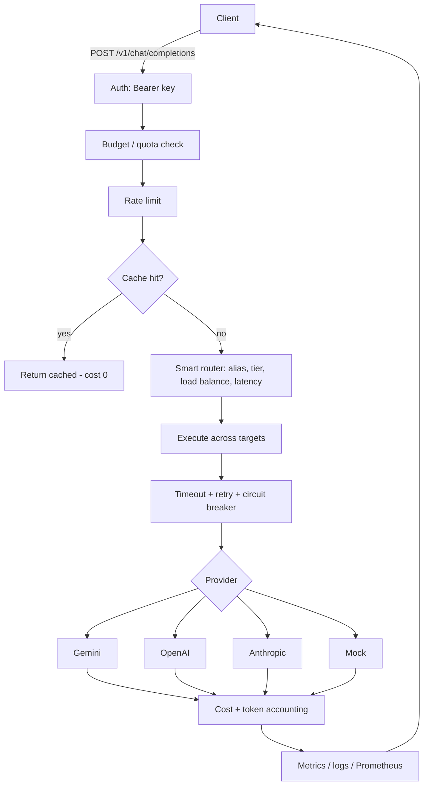

# LLM Gateway

[](https://github.com/tridpt/llm-gateway/actions/workflows/ci.yml)

A production-style gateway/proxy that sits between your application and LLM providers (OpenAI, Anthropic). It exposes an **OpenAI-compatible API** and adds the cross-cutting concerns you need to run LLMs in production:

- **Multi-provider fallback** — try a primary provider, automatically fall back to others on failure
- **Smart routing** — model aliases, tiered routing (free → cheap → premium), weighted round-robin load balancing, and latency-based routing
- **Key rotation** — multiple API keys per provider, round-robined with automatic cooldown of rate-limited keys
- **Reliability** — per-request timeouts, retry with exponential backoff, and a per-provider circuit breaker
- **Response caching** — identical requests are served from cache (huge cost & latency win)
- **Cost tracking** — per-request token counting and USD cost using a configurable pricing table
- **Rate limiting** — sliding-window limits per client API key
- **Budgets & quotas** — per-key daily request count and USD cost limits, enforced with HTTP 429
- **Token saver** — trims long history and whitespace before calling the provider to cut input tokens
- **Streaming** — Server-Sent Events (SSE) pass-through, plus streamed replay of cached answers
- **Embeddings** — OpenAI-compatible `/v1/embeddings` for RAG / semantic search
- **Anthropic-compatible** — `/v1/messages` endpoint, so Claude SDK / Claude Code clients can point at the gateway too
- **Observability** — structured JSONL logs, a live metrics dashboard, and a Prometheus `/metrics` endpoint
- **Gateway auth** — clients authenticate with `Authorization: Bearer <key>`

Built with Node.js (ESM) and Express. Zero AI SDK dependencies — providers are thin `fetch` adapters, which keeps the data flow easy to read and reason about.

## Documentation

- [API Reference](docs/API.md) — every endpoint, request/response shapes, errors
- [Configuration Reference](docs/CONFIGURATION.md) — all env vars, `routes.json`, `budgets.json`
- [Architecture & Design](docs/ARCHITECTURE.md) — request lifecycle, module map, design decisions
- [TAI_LIEU.md](TAI_LIEU.md) — Vietnamese deep-dive + interview Q&A

## Why this exists

Every team that ships LLM features rebuilds the same plumbing: caching, retries, fallback, cost dashboards, rate limits. A gateway centralizes that so application code stays simple and you get one place to observe and control spend.

## Architecture



```
client ──► /v1/chat/completions
             │
             ├─ auth (Bearer key)
             ├─ budget / quota (per key, daily)
             ├─ rate limit (per key, sliding window)
             ├─ cache lookup ──────────────► hit ─► return (cost $0)
             │                                  │
             ├─ smart router (alias/tier/LB/latency)
             └─ execute across targets (timeout+retry+circuit) ──► fallback
                  gemini → openai → anthropic → mock
             │
             ├─ cost + token accounting
             ├─ metrics + Prometheus
             └─ structured logging
```

| Layer | File |
|-------|------|
| Server wiring | `src/index.js` |
| Config / `.env` loader | `src/config.js` |
| Provider adapters | `src/providers/{mock,openai,anthropic,gemini}.js` |
| Fallback logic | `src/providers/index.js` |
| Smart router | `src/routing/router.js` |
| Key rotation pool | `src/services/keypool.js` |
| Latency tracker | `src/services/latency.js` |
| Cache (TTL + LRU) | `src/services/cache.js` |
| Reliability (timeout/retry/circuit) | `src/services/reliability.js` |
| Cost & tokens | `src/services/cost.js` |
| Metrics | `src/services/metrics.js` |
| Logging | `src/services/logger.js` |
| Auth / rate limit | `src/middleware/*` |
| Budget / quota | `src/services/budget.js` |
| Token saver | `src/services/tokenSaver.js` |
| Chat route (core) | `src/routes/chat.js` |
| Embeddings route | `src/routes/embeddings.js` |
| Anthropic route | `src/routes/anthropic.js` |
| Models route | `src/routes/models.js` |
| Admin route | `src/routes/admin.js` |
| Dashboard | `public/index.html` |

## Quick start

```bash
npm install
cp .env.example .env   # already created for local dev
npm start
```

Then:

- Gateway: <http://localhost:8080>
- Dashboard: <http://localhost:8080/dashboard>

The default config uses the **mock provider**, so it runs with no API keys and no cost.

### Make a request

```bash
curl -X POST http://localhost:8080/v1/chat/completions \
  -H "Authorization: Bearer demo-key-123" \
  -H "Content-Type: application/json" \
  -d '{"model":"gpt-4o-mini","messages":[{"role":"user","content":"hello"}]}'
```

Streaming:

```bash
curl -N -X POST http://localhost:8080/v1/chat/completions \
  -H "Authorization: Bearer demo-key-123" \
  -H "Content-Type: application/json" \
  -d '{"model":"gpt-4o-mini","stream":true,"messages":[{"role":"user","content":"hello"}]}'
```

### Embeddings & semantic search

```bash
curl -X POST http://localhost:8080/v1/embeddings \
  -H "Authorization: Bearer demo-key-123" \
  -H "Content-Type: application/json" \
  -d '{"model":"mock-embed","input":["first text","second text"]}'
```

Use `"model":"mock-embed"` to run fully offline, or a real model like
`gemini-embedding-001` / `text-embedding-3-small`. The included demo embeds a
small knowledge base, embeds a query, and ranks documents by cosine similarity —
the retrieval half of a RAG pipeline, end to end through the gateway:

```bash
node examples/semantic-search.mjs "how do you stop calling a failing provider?"
# offline:
EMBED_MODEL=mock-embed node examples/semantic-search.mjs "your query"
```

### Anthropic-compatible endpoint

Clients that speak the Anthropic Messages API can use the same gateway:

```bash
curl -X POST http://localhost:8080/v1/messages \
  -H "Authorization: Bearer demo-key-123" \
  -H "Content-Type: application/json" \
  -d '{"model":"gemini-2.5-flash-lite","max_tokens":100,"messages":[{"role":"user","content":"hello"}]}'
```

The gateway translates the Anthropic request to its internal format, runs the
full pipeline (routing, fallback, cache, budget…), and translates the response
(and SSE stream) back to Anthropic shape.

## Using real providers

Edit `.env`:

```ini
PROVIDER_ORDER=openai,anthropic   # openai primary, anthropic fallback
OPENAI_API_KEY=sk-...
ANTHROPIC_API_KEY=sk-ant-...
```

### Google Gemini (free tier)

Gemini has a **free tier** and an OpenAI-compatible endpoint, so it's the
cheapest way to run the gateway against a real LLM. Get a key at
<https://aistudio.google.com/apikey>, then:

```ini
PROVIDER_ORDER=gemini
GEMINI_API_KEY=AI...
```

Use a Gemini model name in requests, e.g. `"model": "gemini-2.0-flash"`.

You can also chain providers for resilience, e.g.
`PROVIDER_ORDER=gemini,openai` — Gemini first, OpenAI as fallback.

Because the gateway speaks the OpenAI request shape, the Anthropic adapter translates requests to Claude's `/v1/messages` format automatically. Unconfigured providers (missing key) are skipped, so a partial setup still works.

## Endpoints

| Method | Path | Description |
|--------|------|-------------|
| POST | `/v1/chat/completions` | OpenAI-compatible chat completion (auth + rate limited) |
| POST | `/v1/embeddings` | OpenAI-compatible embeddings for RAG / semantic search |
| POST | `/v1/messages` | Anthropic-compatible Messages API (translated in & out) |
| GET | `/v1/models` | OpenAI-compatible model catalogue (includes aliases) |
| GET | `/admin/metrics` | Aggregate metrics + recent requests |
| GET | `/admin/routes` | Active routing config (aliases, tiers, models) |
| GET | `/admin/usage` | Per-key budget usage |
| GET | `/metrics` | Prometheus exposition format (for scraping/Grafana) |
| POST | `/admin/metrics/reset` | Reset counters |
| POST | `/admin/cache/clear` | Empty the cache |
| GET | `/admin/pricing` | Current pricing table |
| GET | `/health` | Liveness probe |
| GET | `/dashboard` | Live observability UI |

## Configuration

All via `.env` (see `.env.example` for the full list): provider order, API keys, cache TTL/size, rate-limit window/max, logging.

## Tests

```bash
npm test
```

Uses Node's built-in test runner against the mock provider — no keys or network needed.

## Smart routing

Routing is driven by an optional `routes.json` at the project root. It turns a
requested model name into an ordered list of concrete targets (`provider` +
`model`) that form the fallback chain:

```json
{
  "strategy": "tier",
  "tiers": ["free", "cheap", "premium", "fallback"],
  "aliases": { "fast": "gemini-2.5-flash-lite", "smart": "gemini-2.5-pro" },
  "models": {
    "gemini-2.5-flash-lite": [
      { "provider": "gemini", "model": "gemini-2.5-flash-lite", "tier": "free" },
      { "provider": "mock",   "model": "mock-gpt",              "tier": "fallback" }
    ],
    "balanced": [
      { "provider": "gemini", "model": "gemini-2.5-flash-lite", "tier": "free", "weight": 2 },
      { "provider": "mock",   "model": "mock-gpt",              "tier": "free", "weight": 1 }
    ]
  }
}
```

- **Aliases** — clients call a stable virtual name (`fast`, `smart`); you remap the backend without touching client code.
- **Tiered routing** — targets are grouped by tier and tried in the order listed in `tiers` (e.g. cheapest first). Failover moves down the tiers.
- **Load balancing** — multiple same-tier targets are spread via weighted round-robin (`weight`). Above, `gemini` gets ~2/3 of `balanced` traffic.
- **Latency routing** — set `ROUTING_STRATEGY=latency` (or `strategy` in the file) to order same-tier targets by observed EWMA latency, fastest first. Unmeasured targets are tried first to gather data.

If a model isn't in `routes.json`, the gateway uses the default behaviour: try
each configured provider in `PROVIDER_ORDER` with the requested model name.
Routing state is visible at `/admin/routes` and `/admin/metrics`.

## Budgets & quotas

Each API key has a daily **request count** limit and a daily **cost (USD)**
limit. When either is reached, requests are rejected with HTTP 429
(`budget_exceeded`) and a `Retry-After` pointing at the next UTC midnight, when
usage resets.

Per-key limits live in an optional `budgets.json`; keys without an override use
the defaults (`DEFAULT_DAILY_REQUESTS`, `DEFAULT_DAILY_COST_USD`):

```json
{
  "default": { "dailyRequests": 1000, "dailyCostUsd": 1.0 },
  "keys": {
    "limited-key": { "dailyRequests": 3, "dailyCostUsd": 0.001 }
  }
}
```

A `null` limit means unlimited. Every response carries the current usage in
`X-Budget-*` headers so clients can self-throttle. Live usage is at
`/admin/usage` and on the dashboard.

## Token saver

Set `TOKEN_SAVER_ENABLED=true` to trim chat requests before they hit a provider:

- collapses runs of whitespace in message content
- keeps only the most recent `TOKEN_SAVER_MAX_MESSAGES` non-system messages
- drops oldest messages until the estimate fits `TOKEN_SAVER_MAX_INPUT_TOKENS`

System messages and the most recent message are always preserved, so the
request stays valid. Total tokens saved is tracked in `/admin/metrics`.

## Key rotation

Each provider accepts **multiple comma-separated API keys**
(`GEMINI_API_KEY=key1,key2,key3`). The gateway round-robins across them and,
when a key returns 429, rests it for `KEY_COOLDOWN_SECONDS` before reusing it.
Combined with request retry, a single rate-limited response transparently
rotates to another key on the immediate retry — so pooled quota keeps a busy
workload flowing. Pool health (ready/resting keys) is shown at `/admin/metrics`
and on the dashboard.

## Reliability

Every provider call goes through three layers, configurable in `.env`:

1. **Timeout** (`REQUEST_TIMEOUT_MS`) — a call that hangs is aborted instead of blocking forever.
2. **Retry with backoff** (`RETRY_MAX`, `RETRY_BASE_MS`) — transient errors (HTTP 408/429/5xx, timeouts, network failures) retry the *same* provider with exponential backoff + jitter. Hard errors (400/401/403) fail fast — no point retrying a bad request.
3. **Circuit breaker** (`CIRCUIT_FAILURE_THRESHOLD`, `CIRCUIT_COOLDOWN_SECONDS`) — after N consecutive failures a provider is "opened" and skipped for a cooldown window, so the gateway stops wasting time (and your latency budget) on a provider that's down. It half-opens after cooldown to test recovery.

Only then, if a provider still fails, does the request **fall back** to the next provider in `PROVIDER_ORDER`. Circuit state is visible at `/admin/metrics` and on the dashboard.

For streaming, retries/fallback apply only to the initial connection — once bytes are flowing the gateway commits to that provider (you can't cleanly swap providers mid-stream).

## Production notes

This is a learning/portfolio project. To run it for real you'd want to:

- Back the cache, rate limiter, and circuit-breaker state with **Redis** (so they work across multiple instances)
- Export metrics to **Prometheus / OpenTelemetry** instead of in-memory
- Replace the char-based token estimate with a real tokenizer (`tiktoken`) for non-OpenAI paths

## License

MIT
